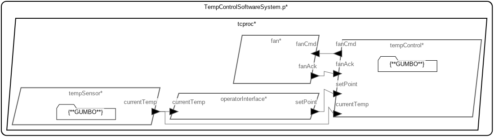

# Temperature Control - Periodic Version

 Table of Contents
<!--table-of-contents_start-->
  * [Tool Installation](#tool-installation)
  * [AADL Model with GUMBO Contracts](#aadl-model-with-gumbo-contracts)
  * [Running HAMR Code Generation](#running-hamr-code-generation)
    * [From within FMIDE](#from-within-fmide)
    * [From the Command Line](#from-the-command-line)
  * [Slang Behavior Code](#slang-behavior-code)
  * [How to Build and Run the Generated Slang Program](#how-to-build-and-run-the-generated-slang-program)
  * [Verifying the Slang Program Using Logika](#verifying-the-slang-program-using-logika)
    * [From the Command Line](#from-the-command-line)
    * [From within IVE](#from-within-ive)
<!--table-of-contents_end-->


## Tool Installation
<!--tool-installation_start-->
- Install Sireum and IVE by following the instructions at [https://github.com/sireum/kekinian#setup](https://github.com/sireum/kekinian#setup)

- Install FMIDE

  From the command line run:

  ```
  $SIREUM_HOME/bin/install/fmide.cmd
  ```

  where ``$SIREUM_HOME`` is the environment variable that Sireum's installation instructions suggests creating

<!--tool-installation_end-->


## AADL Model with GUMBO Contracts
<!--aadl-model-with-gumbo-contracts_start-->

|System: [TempControlSoftwareSystem_p_Instance](aadl/packages/TempControlSoftwareSystem.aadl#L60)|
|--|
|

|[tempSensor](aadl/packages/TempSensor.aadl#L94)|
|--|
|[GUMBO contract](aadl/packages/TempSensor.aadl#L65)|
|Periodic: 1000 ms|


|[fan](aadl/packages/CoolingFan.aadl#L32)|
|--|
|Periodic: 1000 ms|


|[tempControl](aadl/packages/TempControlSoftwareSystem.aadl#L258)|
|--|
|[GUMBO contract](aadl/packages/TempControlSoftwareSystem.aadl#L137)|
|Periodic: 1000 ms|


|[operatorInterface](aadl/packages/TempControlSoftwareSystem.aadl#L356)|
|--|
|Periodic: 1000 ms|

<!--aadl-model-with-gumbo-contracts_end-->


## Running HAMR Code Generation
<!--running-hamr-code-generation_start--><!--running-hamr-code-generation_end-->

### From within FMIDE
<!--from-within-fmide_start-->
To run HAMR Codegen, select [this](aadl/packages/TempControlSoftwareSystem.aadl#L60) system implementation in FMIDE's outline view and then click the
HAMR button in the toolbar.  Use the following values in the dialog box that opens up (_&lt;example-dir&gt;_ is the directory that contains this readme file)

Option Name|Value |
|--|--|
Platform|JVM|
Output Directory|_&lt;example-dir&gt;_/hamr/slang|
Base Package Name|tc|

<!--from-within-fmide_end-->


### From the Command Line
<!--from-the-command-line_start-->
Run the following script: [aadl/bin/run-hamr.cmd](aadl/bin/run-hamr.cmd)

```
./aadl/bin/run-hamr.cmd
```
<!--from-the-command-line_end-->


## Slang Behavior Code
<!--slang-behavior-code_start-->
  * [tempSensor*](hamr/slang/src/main/component/tc/TempSensor/TempSensorPeriodic_p_tcproc_tempSensor.scala)

  * [fan](hamr/slang/src/main/component/tc/CoolingFan/FanPeriodic_p_tcproc_fan.scala)

  * [tempControl*](hamr/slang/src/main/component/tc/TempControlSoftwareSystem/TempControlPeriodic_p_tcproc_tempControl.scala)

  * [operatorInterface](hamr/slang/src/main/component/tc/TempControlSoftwareSystem/OperatorInterfacePeriodic_p_tcproc_operatorInterface.scala)

 *\* denotes the the file contains Logika contracts derived from GUMBO*
<!--slang-behavior-code_end-->

## How to Build and Run the Generated Slang Program
<!--how-to-build-and-run-the-generated-slang-program_start-->
See the instructions in the generated Proyek project definition file [hamr/slang/bin/project.cmd](hamr/slang/bin/project.cmd)
for instructions on how to build/run the program from within IVE or from
the command line
<!--how-to-build-and-run-the-generated-slang-program_end-->

## Verifying the Slang Program Using Logika
<!--verifying-the-slang-program-using-logika_start--><!--verifying-the-slang-program-using-logika_end-->

### From the Command Line
<!--from-the-command-line_start-->
To have Logika verify the entire program, ``cd`` to the directory that contains this
readme and then run the following

```
$SIREUM_HOME/bin/sireum proyek logika --all ./hamr/slang
```

Note that you may need to increase Logika's timeout option on older/less capable machines.  The
default timeout is 2 seconds and to increase that to 3 you'd run

```
$SIREUM_HOME/bin/sireum proyek logika --timeout 3 --all ./hamr/slang
```

<!--from-the-command-line_end-->


### From within IVE
<!--from-within-ive_start-->
In IVE open the Slang file you want to verify.  If the file is in Logika
(identified by the presence of ``#Logika`` in the first line) then you'll be able to
 select ``Logika Check (All in File)`` from the context menu.

Logika's timeout option can be set by navigating to
``Preferences >> Tools >> Sireum >> Logika`` and setting the desired timeout
in milliseconds
<!--from-within-ive_end-->

